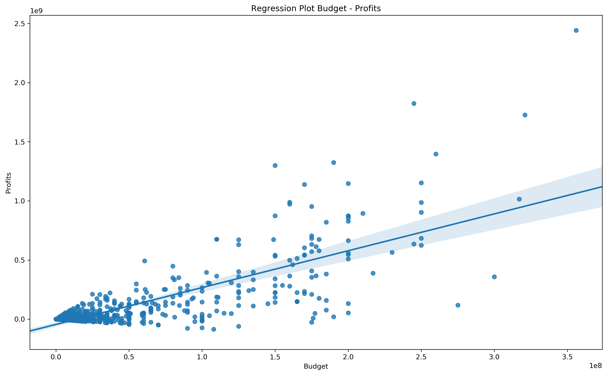
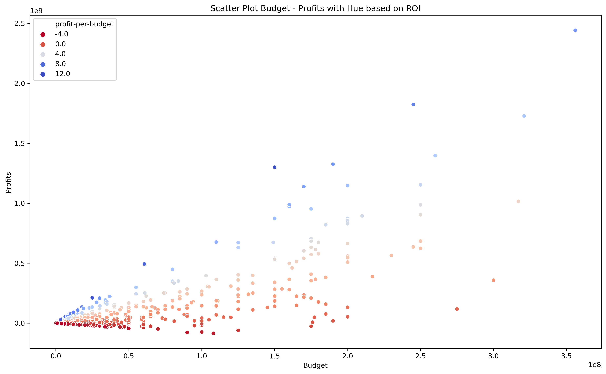
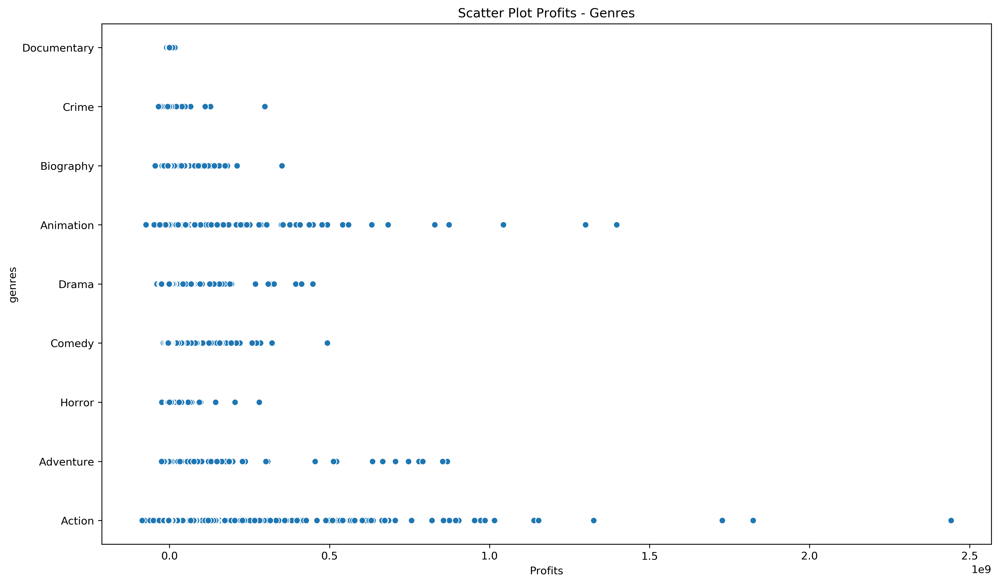

# Action! An Exploratory Data Analysis on Film Production

What are the best films to be produced by Return-On-Investment and profits? An exploratory data analysis on film production in the last 5 years, from 2014 to 2019, using scraped data from IMDBPro. A project developed for Module 1 of the Online Data Science Bootcamp at Flatiron School.

[Blog post/mini-website: Action! An Exploratory Data Analysis on Film Production](https://action.marconasuto.com/)

Our guiding question throughout our analysis has been:

    - What type of films are currently doing the best?

In the context of Microsoft willing to open a movie studio, this question could be translated as:

    - In what type of films Microsoft should invest?

In terms of investment, initial budget, profits and Return-Of-Investment (ROI) are keys. 
We then moved to our analysis to:

    - What are the most intersting genres in terms of ROI?

To do so, we used two models:
- **Model 1**: we  categorized films by two genres. This approach does give more precise information on what specific subgenre is more promising. However, due to lack of data, it becomes unreliable when it comes to make recommendations on other essential aspects of the film business: who to involve to "make it" - producers, directors, writers and actors. For this reason, we used model 2 when it came to make recommedations on who to select for our future cast.

- **Model 2**: we categorised films by their main genre. The trade off with respect to Model 1 was to lose some granularity in terms of the specific, potentially most profitable subgenres. Neverthless, first we spotted the main potential genres in terms of ROI. Then we analysed their trends througout the years. We want to produce films that belong to "trending" genres not to those who show signs of decline. 

## Project Outline

    ├── LICENSE
    ├── README.md                  <- The project layout (this file)
    ├── data
    │   ├── images                 <- For README.md and presentation
    │   ├── external               <- Data from imdbpro
    │   ├── processed              <- The final, canonical data sets for analysis
    │   └── raw                    <- The original, immutable data dump
    │
    ├── notebooks                  <- Jupyter notebooks
    │   └── data_gathering.ipynb   <- Process for obtaining desired data points
    │   └── data_cleaning.ipynb   <- Process for cleaning the data
    │   └── eda.ipynb              <- Process for exploring and analyzing the data
    │
    ├── reports                    <- Reports and presentations
    │   └── presentation.pdf       <- Non-technical presentation
    │   └── blog.md                <- Blog post
    │   └── video_walkthrough      <- Link to video walkthrough
    │
    │
    └── requirements.txt           <- The requirements file for reproducing the analysis environment 
## Recommendations
From the data we learnt that:

    - **High profits require high budget**

    - **ROI and budget are not related**

We spotted **three main genres** where to start producing films by ROI: 

 <h2>Action</h2>

<h2>Adventure</h2>

<h2>Animation</h2>

We also see potential in **two more genres** that have been growing in the last 5 years
  
<h2>Comedy</h2>

<h2>Horror</h2>

Whereas it is possible to come up with recommendations on potential sets of cast to hire for Action, Adventure, Animation and Comedy films, there is not enough data for Horror films.

## Example of  a film to produce
As a final recommendation, we picked the best genre and cast to start with from a profitability point-of-view.

- Genre: **Action** - highest profits, high median ROI
- Producers: **Kevin Feidge** - high median ROI, a significant number of films in the last 5 years (3 films produced)
- Directors: **Anthony Russo** - high median ROI, high number of films in the last 5 years
- Writers: **Stephen McFeely** - good median ROI, high median profit
- Actors: **Chris Evans, Robert Downey Jr., Don Cheadle** - high median ROI, high profits, high number of films in the last 5 years

## Conclusions
To help Microsoft creating a new movie studio, we broke the problem into several steps and tasks and followed a quite standard methodology for Exploratory Data Analysis.

Once scoped the problem from a business point of view, we moved to getting the data from IMDBpro, cleaning and scrublling it. 

In our EDA we concluded that:

- High profits require high budget
- ROI and budget are not related

We spotted **three main genres** where to start producing films by ROI:

- Action
- Adventure
- Animation

We also see potential in **two more genres** that have been growing in the last 5 years

- Comedy
- Horror

Whereas it is possible to come up with recommendations on potential sets of cast to hire for Action, Adventure, Animation and Comedy films, there is not enough data for Horror films.

Possible further analysis would require more and different data.

Finally, based on our data analysis, we delivered an example of a film to produce, selecting the most profitable genre, best producers, directors, writers, and actors.
